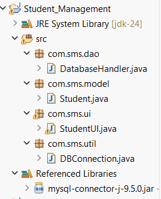
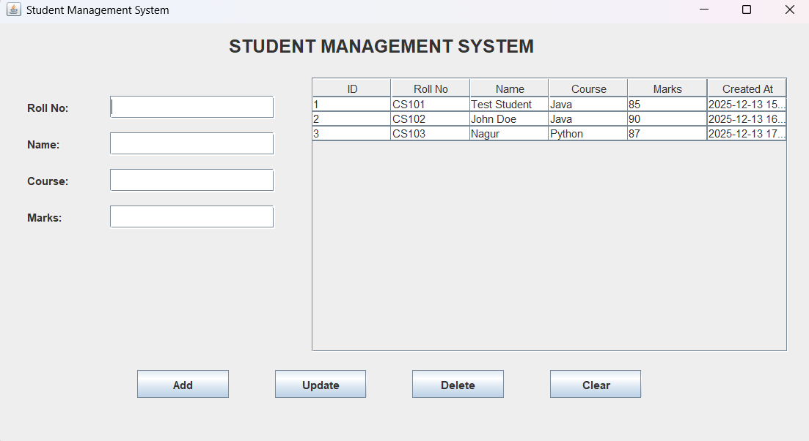

# 🎓 Student Management System (Java Swing + MySQL)

A desktop-based **Student Management System** developed using **Java Swing**, **JDBC**, and **MySQL**.  
This project was built as part of a **Java Developer Internship**, following **OOP principles** and a **3-layer architecture**.

---

## 🚀 Features

- ➕ Add new student records  
- ✏️ Update existing student details  
- 🗑️ Delete student records with confirmation  
- 📋 View all students in a sortable table  
- ✅ Input validation (empty fields, marks range, duplicate roll numbers)  
- 💾 Persistent storage using MySQL  
- 🔒 Secure database access using PreparedStatement  
- 🖥️ Clean and user-friendly Java Swing UI  

---

## 🛠️ Technologies Used

- Java 11  
- Java Swing (GUI)  
- JDBC  
- MySQL  
- Eclipse IDE  

---

## 🧱 Project Architecture

The project follows a **3-Layer Architecture**:

* com.sms.model → Student (Model / POJO)
* com.sms.dao → DatabaseHandler (DAO / JDBC Layer)
* com.sms.ui → StudentUI (Swing UI Layer)
* com.sms.util → DBConnection (Database Utility)


---

## 🗄️ Database Schema

**Database Name:** `student_management`  
**Table Name:** `students`

```sql
CREATE TABLE students (
    id INT PRIMARY KEY AUTO_INCREMENT,
    roll_no VARCHAR(20) UNIQUE NOT NULL,
    name VARCHAR(100) NOT NULL,
    course VARCHAR(50) NOT NULL,
    marks INT CHECK (marks BETWEEN 0 AND 100),
    created_at TIMESTAMP DEFAULT CURRENT_TIMESTAMP
);
```

### ▶️ How to Run the Project
**Prerequisites**

* Java 11 or above
* MySQL Server
* Eclipse IDE
* MySQL JDBC Connector (mysql-connector-j-8.x.x.jar)

**Steps**

**1.** Clone the repository:
```git
git clone https://github.com/nagur18/<repository-name>.git
```
**2.** Open Eclipse → Import Existing Java Project
**3.** Add MySQL JDBC .jar to Build Path
**4.** Update DB credentials in:
```git
com.sms.util.DBConnection
```
**5.** Run
```git
StudentUI.java
```

### StudentUI.java



### 🎯 Learning Outcomes

* Hands-on experience with Java Swing
* Practical usage of JDBC and MySQL
* Understanding of MVC / DAO design pattern
* Input validation and exception handling
* Building real-world CRUD desktop applications

### 📌 Future Enhancements

* Search and filter students
* Export data to PDF / Excel
* Login authentication
* UI enhancement using JavaFX

### 👨‍💻 Author

- **Nagur Vali**
- **Java Developer Intern**
- GitHub: https://github.com/nagur18


